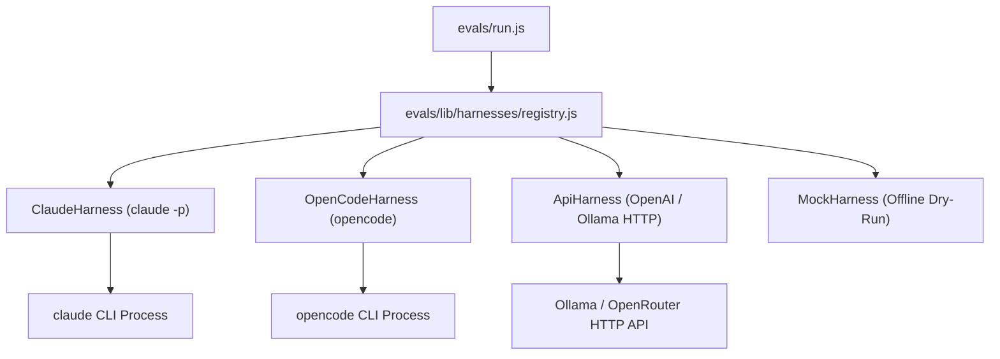

# Requirements

### Overview & Goals
The goal of this initiative is to substantially lower the cost of running evaluations in this repository while accommodating developers with low-spec local hardware. 

Currently, the evaluation harness (`evals/run.js` and `evals/lib/runner-lib.js`) relies exclusively on spawning the `claude` CLI, which executes paid Anthropic API calls (costing ~$15 for a full pilot suite run).

This plan introduces:
1. A **Pluggable Harness Adapter Architecture** allowing evaluations to run via `opencode` CLI or direct HTTP calls to OpenAI-compatible endpoints (e.g., Ollama running local models like Qwen 2.5 Coder 7B, or free cloud models via OpenRouter/Gemini Flash).
2. A **Hybrid Execution Split** allowing heavy scenario execution to run on local/free models while reserving lightweight cloud judge models exclusively for rubric scoring.
3. **Selective Filtering & Offline Mocking** (`--case <id>`, `--mock`) to allow rapid offline dry-runs and single-case smoke testing without token usage.
4. **Pre-flight Budget Safety Guards** to prevent accidental token overruns.

### Scope

#### In Scope
- Creating a modular harness registry in `evals/lib/harnesses/` with adapters for `claude`, `opencode`, `api` (OpenAI-compatible / Ollama / OpenRouter), and `mock`.
- Extending CLI flags in `evals/run.js`: `--harness`, `--judge-harness`, `--case <id>`, `--mock`, `--endpoint`, `--api-key`.
- Supporting hybrid model runs where scenario generation uses a local/free harness and judging uses a lightweight cloud model (e.g. Haiku / Flash).
- Adding an offline `--mock` mode to test harness logic and runner updates with zero token cost.
- Updating `evals/README.md` with instructions on running evaluations locally on low-hardware setups using OpenCode, Ollama, and free model endpoints.

#### Out of Scope
- Modifying existing skill definitions (`skills/*`) or evaluation cases/rubrics (`evals/skills/*`).
- Modifying third-party OpenCode CLI or Ollama binaries directly.
- Adding npm external dependencies (maintaining Node.js built-ins only design).

### User Stories
- **As a developer on low-spec hardware**, I want to run evaluations via OpenCode or local LLMs (like Qwen 2.5 Coder 7B in Ollama) or free cloud endpoints (OpenRouter/Gemini Flash) so that I do not incur high Anthropic API costs.
- **As an evaluation author**, I want to run a single case or trigger-only test in `--mock` mode so that I can verify runner updates offline without spending money.
- **As a maintainer**, I want to route scenario runs through a free/local engine and rubric scoring through a fast judge model so that I maintain grading quality at minimum cost.

### Functional Requirements
- **Harness Adapter Selection**: `--harness <claude|opencode|api|mock>` selects the primary runner engine.
- **Hybrid Judge Routing**: `--judge-harness <claude|opencode|api|mock>` allows routing judge scoring independently.
- **Case Filtering**: `--case <case_id>` limits evaluation execution to a single specific case ID.
- **Offline Mock Mode**: `--mock` returns static deterministic responses and zero cost metrics instantly.
- **Pre-flight Budget Guards**: Runner estimates cost pre-flight and halts execution if budget threshold is exceeded unless `--yes` is passed.

### Non-Functional Requirements
- **Zero External npm Dependencies**: Harness uses only Node built-in modules (`node:child_process`, `node:fs`, `fetch`).
- **Backward Compatibility**: Running `node evals/run.js` without new flags maintains identical behavior with the existing `claude` CLI.

# Technical Design

### Current Implementation
- `evals/run.js`: Handles argument parsing, per-skill case loading, cost estimation, parallel execution via `pMapLimit`, baseline comparison, and summary table formatting.
- `evals/lib/runner-lib.js`: Contains helper functions (`runTriggerCase`, `runQualityCase`, `runJudge`) that directly spawn the `claude` binary via `node:child_process`.

### Key Decisions
- **Decision 1: Pluggable Adapter Registry Pattern**
  - Implement a central harness registry (`evals/lib/harnesses/registry.js`) exposing a standard interface: `runTriggerCase`, `runQualityCase`, and `runJudge`.
  - Concrete adapters: `ClaudeHarness`, `OpenCodeHarness`, `ApiHarness`, and `MockHarness`.
  - Rationale: Decouples runner script logic from specific CLI flags and API formats, enabling seamless support for OpenCode and local/free models.
- **Decision 2: Hybrid Dual-Harness Routing**
  - Allow specifying `--harness` (for trigger & quality scenario cases) and `--judge-harness` (for rubric evaluation) independently.
  - Rationale: Allows users to run heavy scenario passes on local/free OpenCode models while keeping rubric grading fast and accurate using cheap cloud judge models.
- **Decision 3: Pre-flight Guard and Offline Mocking**
  - Implement a `--mock` harness option that simulates execution outputs instantly.
  - Rationale: Facilitates rapid testing of harness plumbing and evaluation scripts offline without hardware or API constraints.

### Proposed Changes

#### Architecture Diagram


#### Code Structures & Interfaces
Unified Harness Interface (`abstract-harness.js`):
```javascript
export class AbstractHarness {
  async runTriggerCase(prompt, options) { throw new Error("Not implemented"); }
  async runQualityCase(slug, prompt, options) { throw new Error("Not implemented"); }
  async runJudge(rubric, scenarioPrompt, transcript, options) { throw new Error("Not implemented"); }
}
```

#### File Structure Changes
- **Add**: `evals/lib/harnesses/abstract-harness.js` - Base harness class interface.
- **Add**: `evals/lib/harnesses/claude-harness.js` - Refactored `claude -p` execution adapter.
- **Add**: `evals/lib/harnesses/opencode-harness.js` - Adapter spawning `opencode` CLI.
- **Add**: `evals/lib/harnesses/api-harness.js` - Adapter sending direct HTTP calls to Ollama / OpenAI-compatible endpoints.
- **Add**: `evals/lib/harnesses/mock-harness.js` - Offline dry-run adapter.
- **Add**: `evals/lib/harnesses/registry.js` - Factory function resolving harness instances by name.
- **Modify**: `evals/lib/runner-lib.js` - Delegate runner functions to active harness instances.
- **Modify**: `evals/run.js` - Parse new flags (`--harness`, `--judge-harness`, `--case`, `--mock`, `--endpoint`) and apply filtering.
- **Modify**: `evals/README.md` - Document OpenCode, local model setup (Ollama/Qwen), free API usage, and CLI options.

# Testing

### Validation Approach
All harness changes can be verified using the new `--mock` offline dry-run capability as well as targeted single-case runs against local or free API endpoints.

### Key Scenarios
1. **Offline Mock Suite Validation**:
   - Command: `node evals/run.js --mock`
   - Expected Outcome: Runs all 5 pilot skills instantly with $0 cost, exercises runner pipeline, and produces valid result files in `evals/results/`.
2. **Single Case Filtering**:
   - Command: `node evals/run.js swebok-process --case trigger_pos_1 --mock`
   - Expected Outcome: Filters execution to only the single specified case ID.
3. **Hybrid Harness Execution**:
   - Command: `node evals/run.js swebok-process --harness opencode --judge-harness claude --mock`
   - Expected Outcome: Dispatches scenario execution to `OpenCodeHarness` and judge evaluation to `ClaudeHarness`.
4. **Pre-flight Budget Guard**:
   - Command: `node evals/run.js --max-total-budget-usd 0.01`
   - Expected Outcome: Refuses to run with an estimate warning unless `--yes` or `--mock` is specified.

# Delivery Steps

### ✓ Step 1: Implement harness registry and mock backend adapter
The harness registry and offline mock backend allow zero-cost testing and pluggable execution infrastructure.

- Create `evals/lib/harnesses/abstract-harness.js` defining the unified harness interface (`runTriggerCase`, `runQualityCase`, `runJudge`).
- Create `evals/lib/harnesses/mock-harness.js` returning deterministic test fixtures and zero-cost metrics for offline dry-runs.
- Create `evals/lib/harnesses/claude-harness.js` encapsulating existing `claude -p` execution logic.
- Create `evals/lib/harnesses/registry.js` to resolve and instantiate harnesses based on configuration flags.

### ✓ Step 2: Implement OpenCode and OpenAI-compatible API harness adapters
OpenCode CLI and HTTP API harness adapters enable local LLMs (e.g. via Ollama) and free cloud endpoints (e.g. OpenRouter/Gemini).

- Create `evals/lib/harnesses/opencode-harness.js` wrapping `opencode` CLI invocation with model, prompt, and tool flags.
- Create `evals/lib/harnesses/api-harness.js` using native Node `fetch` to query OpenAI-compatible chat completions endpoints.
- Parse tool invocation streams and structured JSON outputs across OpenCode and API response formats.

### ✓ Step 3: Update evaluation runner with harness selection, case filtering, and pre-flight guards
The evaluation runner CLI supports pluggable harnesses, hybrid execution, single-case filtering, and mock dry-runs.

- Extend `parseArgs` in `evals/run.js` for `--harness`, `--judge-harness`, `--case`, `--mock`, `--endpoint`, and `--api-key`.
- Update `evals/lib/runner-lib.js` to dispatch calls through configured primary and judge harness adapters.
- Implement single-case filtering (`--case <id>`) across trigger and quality buckets.
- Update pre-flight budget calculation and mock mode handling in `main()`.

### ✓ Step 4: Update documentation and provide low-hardware local evaluation guide
The repository documentation details cost optimization strategies and instructions for low-hardware local setups.

- Update `evals/README.md` with step-by-step guides for OpenCode, Ollama (e.g., Qwen 2.5 Coder 7B), and free OpenRouter API tiers.
- Document all new CLI parameters (`--harness`, `--judge-harness`, `--mock`, `--case`, `--endpoint`).
- Verify evaluation suite execution using `--mock` dry-run mode.